## Project: Search and Sample Return

Settings : 640x480 - Config : fantastic - FPS : 27

---
---

### 1) Notebook Analysis

#### Image processing - color thresholding

As explained [here](https://docs.opencv.org/3.2.0/df/d9d/tutorial_py_colorspaces.html), I added some functions to use HSV color thresholding to segmentate the rock samples. The code from the notebook is shown below.

```python
## HSV color thresholding
def hsv_thresh( img, lo, hi ) :
    _img_hsv = cv2.cvtColor( img, cv2.COLOR_BGR2HSV )
    _res = cv2.inRange( _img_hsv, lo, hi )
    return _res
```

First, we convert the image to HSV space, and then just pick the range given by **lo** and **hi** .

After some tuning, the **lo** and **hi** ranges to segment the samples were set to :

```python
# ranges for rock-sample segmentation
g_hsv_threshold_rock_lo = np.array( [ 50, 98, 150 ] )
g_hsv_threshold_rock_hi = np.array( [ 140, 255, 255 ] )
```

Below you can see the results of segmenting the rock samples using the previous method :

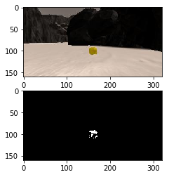
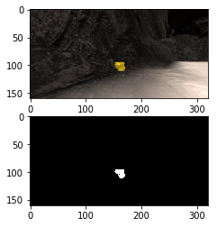
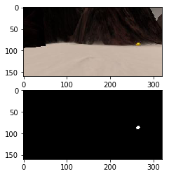
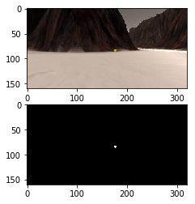
    
For the navigable terrain and the obstacles I used rgb-thresholding as shown in the following snippet :

```python
## RGB color thresholding
def rgb_thresh( img, lo, hi ) :
    _res = cv2.inRange( img, lo, hi )
    return _res
```

For the **lo** and **hi** ranges we picked the values from the lecture, and as suggested, just inverted the nav-terrain ranges to get the obstacle ranges. The values and the results are shown below.

```python
# ranges for obstacle segmentation
g_rgb_threshold_obstacles_lo = np.array( [ 0, 0, 0 ] )
g_rgb_threshold_obstacles_hi = np.array( [ 160, 160, 160 ] )

# ranges for terrain segmentation
g_rgb_threshold_terrain_lo = np.array( [ 160, 160, 160 ] )
g_rgb_threshold_terrain_hi = np.array( [ 255, 255, 255 ] )
```

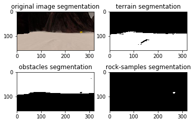

#### Image processing - full pipeline and worldmap creation

I filled the **process_image** method with all the methods involved in the image processing pipeline as requested. The implementation is in the notebook, and these are the parts involved.

*  **Perspective transformation**

    As seen in the classroom, the points chosen to create the perspective transformation matrix are created as follows :

    ```python
    # 1) Define source and destination points for perspective transform
    _dst_size = 5 
    _btm_offset = 6
    _w = img.shape[1]
    _h = img.shape[0]
    _src_pts = np.float32( [ [16, 141], [303 ,141],[201, 98], [120, 98] ] )
    _dst_pts = np.float32( [ [ _w / 2 - _dst_size, _h - _btm_offset ],
                             [ _w / 2 + _dst_size, _h - _btm_offset ],
                             [ _w / 2 + _dst_size, _h - 2 * _dst_size - _btm_offset ], 
                             [ _w / 2 - _dst_size, _h - 2 * _dst_size - _btm_offset ],
                           ])
    ```

    These are the mapping of the trapezoid in the calibration image ( which represents a 1mx1m square ) to a square of size 10px in rover coordinates ( as represented by _dst_size, which is half the size of the square ). There is also an offset that represents the distance between the square mapped and the actual position of the camera respect to the rover.

    Once we have these mapping points we can call our perspective transform method :

    ```python
    # 2) Apply perspective transform
    _img_warped = perspect_transform( img, _src_pts, _dst_pts )
    ```

    The result of this step is an image like this :

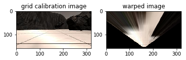

*   **Image thresholding**

    The next step is to segmentate into navigable terrain, obstacles and rock samples. We just call our thresholding functions mentioned before.

    ```python
    # 3) Apply color threshold to identify navigable terrain/obstacles/rock samples
    
    # ranges for terrain segmentation
    _rgb_threshold_terrain_lo = np.array( [ 160, 160, 160 ] )
    _rgb_threshold_terrain_hi = np.array( [ 255, 255, 255 ] )
    # ranges for obstacle segmentation
    _rgb_threshold_obstacles_lo = np.array( [ 0, 0, 0 ] )
    _rgb_threshold_obstacles_hi = np.array( [ 160, 160, 160 ] )
    # ranges for rock segmentation
    _hsv_threshold_rocks_lo = np.array( [ 20, 98, 40 ] )
    _hsv_threshold_rocks_hi = np.array( [ 100, 255, 255 ] )
    
    _img_threshed_terrain   = rgb_thresh( _img_warped, _rgb_threshold_terrain_lo, _rgb_threshold_terrain_hi )
    _img_threshed_obstacles = rgb_thresh( _img_warped, _rgb_threshold_obstacles_lo, _rgb_threshold_obstacles_hi )
    _img_threshed_rocks     = hsv_thresh( _img_warped, _hsv_threshold_rocks_lo, _hsv_threshold_rocks_hi )
    ```

    This would give us three images to work with in the next stage. An example is shown below.

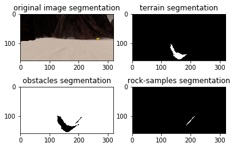

*   **Transformation to Rover-centric coordinates**

    In this stage we take the threshed images and trasnform them into rover centric coordinates.

    As explained in the classroom, the image we get is respect to to the camera's frame of reference, but the rover frame of reference ( respect to which we get the orientation and position data from the other sensors ) is a bit different, as can be seen in the following figure.
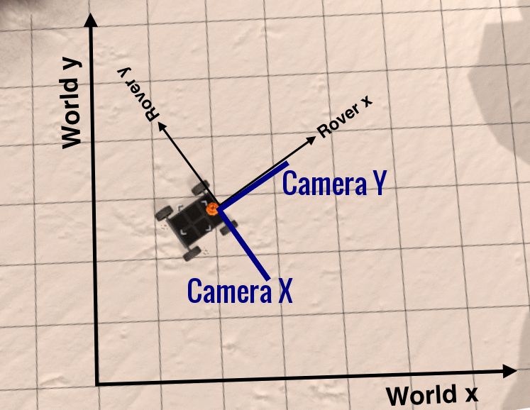

    To implement this step we call the function defined previously that is in charge of this transformation.

    ```python
    def rover_coords( binary_img ) :
        ypos, xpos = binary_img.nonzero()
        x_pixel = np.absolute(ypos - binary_img.shape[0]).astype(np.float)
        y_pixel = -(xpos - binary_img.shape[0]).astype(np.float)

        return x_pixel, y_pixel
    ```

    This method will take all non-zero pixels in a binary image and transform them from the camera frame to the rover frame of reference.
    In the following images you can see the results of applying this function to a terrain threshed image and a rock-sample threshed image, giving the pixels that are non zero in the rover coordinate system.

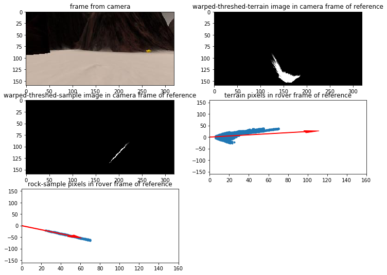

    This pixels are used in the decision step to give the rover a direction to go ( terrain navigable pixels ) and the direction to a rock, if there is one ( rock pixels ) as you could see by the two arrows in the images above.

*   **Transformation from Rover to World coordinates**

    By using the position and orientation provided by the other sensors we can transform the previous terrain pixels into world space by using the following functions.

    ```python
    def rotate_pix(xpix, ypix, yaw) :
        yaw = yaw * np.pi / 180.
        xpix_rotated = np.cos( yaw ) * xpix - np.sin( yaw ) * ypix
        ypix_rotated = np.sin( yaw ) * xpix + np.cos( yaw ) * ypix
        return xpix_rotated, ypix_rotated

    def translate_pix(xpix_rot, ypix_rot, xpos, ypos, scale): 
        xpix_translated = ( xpix_rot / scale ) + xpos
        ypix_translated = ( ypix_rot / scale ) + ypos
        return xpix_translated, ypix_translated

    def pix_to_world(xpix, ypix, xpos, ypos, yaw, world_size, scale):
        xpix_rot, ypix_rot = rotate_pix(xpix, ypix, yaw)
        xpix_tran, ypix_tran = translate_pix(xpix_rot, ypix_rot, xpos, ypos, scale)
        x_pix_world = np.clip(np.int_(xpix_tran), 0, world_size - 1)
        y_pix_world = np.clip(np.int_(ypix_tran), 0, world_size - 1)
        return x_pix_world, y_pix_world
    ```

    This step is implemented in the following piece of code in the process_image function :

    ```python
    _rover2world_scale = 10
    _world_size = 200

    _x = data.xpos[ data.count ]
    _y = data.ypos[ data.count ]
    _yaw = data.yaw[ data.count ]
    
    x_navigable_world, y_navigable_world = pix_to_world( x_navigable_rover, 
                                                         y_navigable_rover,
                                                         _x, _y, _yaw, 
                                                         _world_size, 
                                                         _rover2world_scale )
    
    x_obstacles_world, y_obstacles_world = pix_to_world( x_obstacles_rover, 
                                                         y_obstacles_rover,
                                                         _x, _y, _yaw, 
                                                         _world_size, 
                                                         _rover2world_scale )
    
    x_rocks_world, y_rocks_world         = pix_to_world( x_rocks_rover, 
                                                         y_rocks_rover,
                                                         _x, _y, _yaw, 
                                                         _world_size, _rover2world_scale )
    ```

    Again, there is a scale factor in here, as each pixel represents a square of 1mx1m. Taking this into account and the fact that the pixels from the previous stage represent 0.1mx0.1m, we set the scale factor to 10. Also, the size of the world is given, which is also used in the transformation.

    This would give us a result like the following :

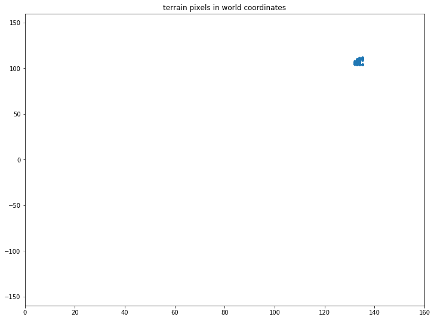

*   **Worldmap creation**

    Finally, the last step is to use the pixels that represent the terrain, obstacles and rock-samples to create our worldmap. This is done in this piece of code :

    ```python
    data.worldmap[y_obstacles_world, x_obstacles_world, 0] += 1
    data.worldmap[y_rocks_world, x_rocks_world, 1] += 1
    data.worldmap[y_navigable_world, x_navigable_world, 2] += 1
    ```

    Here we are basically creating an image of the nav-terrain, obstacles and rock-samples using the pixels from the previous stage. Each layer of the rgb image represents the obstacles, rocks and nav-terrain respectively.

    ```python
    output_image = np.zeros( ( img.shape[0] + data.worldmap.shape[0], 
                               img.shape[1]*2, 3 ) )
    output_image[0:img.shape[0], 0:img.shape[1]] = img

    warped = perspect_transform(img, source, destination)
    output_image[0:img.shape[0], img.shape[1]:] = warped

    map_add = cv2.addWeighted(data.worldmap, 1, data.ground_truth, 0.5, 0)
    output_image[img.shape[0]:, 0:data.worldmap.shape[1]] = np.flipud(map_add)
    ```
    Also, we send some other info to the simulator, namely the original frame from the rover camera, the warped image and the worldmap itself.
    each of these images is used to make a video using moviepy, as shown in the next image.

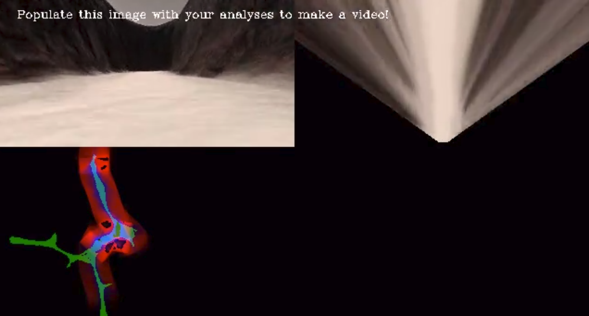

### 2) Autonomous Navigation and Mapping

#### [Perception](https://github.com/wpumacay/RoboND-Rover-Project/blob/master/code/perception.py) and [decision](https://github.com/wpumacay/RoboND-Rover-Project/blob/master/code/decision.py) steps

*   Perception step - worldmap creation

    In this part we adapted the code from the notebook ( process image part explained earlier ) as the first half of the perception pipeline for our rover.

    The thresholds used for segmentation, the mapping points for the perspective transform and the scale parameters for the rover2world transformation are the same as in the notebook, with the only difference that they now work on the frame that comes in the Rover data structure.

    ```python
    roverCameraFrame    = Rover.img
    roverPositionX      = Rover.pos[0]
    roverPositionY      = Rover.pos[1]
    roverOrientationYaw = Rover.yaw
    ```

    You can see this part from lines 93 to 163 in the perception step, which is also shown below.

    ```python
    _dst_size = 5 
    _btm_offset = 6
    _w = Rover.img.shape[1]
    _h = Rover.img.shape[0]
    _src_pts = np.float32( [ [14, 140], [301 ,140],[200, 96], [118, 96] ] )
    _dst_pts = np.float32( [ [ _w / 2 - _dst_size, _h - _btm_offset ],
                             [ _w / 2 + _dst_size, _h - _btm_offset ],
                             [ _w / 2 + _dst_size, _h - 2 * _dst_size - _btm_offset ], 
                             [ _w / 2 - _dst_size, _h - 2 * _dst_size - _btm_offset ],
                           ])

    # 2) Apply perspective transform

    _img_warped = perspect_transform( Rover.img, _src_pts, _dst_pts )

    # 3) Apply color threshold to identify navigable terrain/obstacles/rock samples

    # ranges for terrain segmentation
    _rgb_threshold_terrain_lo = np.array( [ 160, 160, 160 ] )
    _rgb_threshold_terrain_hi = np.array( [ 255, 255, 255 ] )

    # ranges for obstacle segmentation
    _rgb_threshold_obstacles_lo = np.array( [ 0, 0, 0 ] )
    _rgb_threshold_obstacles_hi = np.array( [ 160, 160, 160 ] )

    # ranges for rock segmentation
    _hsv_threshold_rocks_lo = np.array( [ 50, 98, 150 ] )
    _hsv_threshold_rocks_hi = np.array( [ 140, 255, 255 ] )
    
    _img_threshed_terrain   = rgb_thresh( _img_warped, _rgb_threshold_terrain_lo, _rgb_threshold_terrain_hi ) 
    _img_threshed_obstacles = rgb_thresh( _img_warped, _rgb_threshold_obstacles_lo, _rgb_threshold_obstacles_hi ) 
    _img_threshed_rocks     = hsv_thresh( _img_warped, _hsv_threshold_rocks_lo, _hsv_threshold_rocks_hi )
    #_img_threshed_rocks        = hsv_thresh( Rover.img, _hsv_threshold_rocks_lo, _hsv_threshold_rocks_hi )
    #_img_threshed_warped_rocks = perspect_transform( _img_threshed_rocks, _src_pts, _dst_pts )

    # 4) Update Rover.vision_image (this will be displayed on left side of screen)
        # Example: Rover.vision_image[:,:,0] = obstacle color-thresholded binary image
        #          Rover.vision_image[:,:,1] = rock_sample color-thresholded binary image
        #          Rover.vision_image[:,:,2] = navigable terrain color-thresholded binary image

    Rover.vision_image[:, :, 0] = _img_threshed_obstacles
    Rover.vision_image[:, :, 1] = _img_threshed_rocks
    Rover.vision_image[:, :, 2] = _img_threshed_terrain

    # 5) Convert map image pixel values to rover-centric coords

    x_navigable_rover, y_navigable_rover = rover_coords( _img_threshed_terrain )
    x_obstacles_rover, y_obstacles_rover = rover_coords( _img_threshed_obstacles )
    x_rocks_rover, y_rocks_rover         = rover_coords( _img_threshed_rocks )

    # 6) Convert rover-centric pixel values to world coordinates

    _rover2world_scale = 10. # 1pix in world is 1m, whereas 1pix in rover is 0.1m
    _world_size = 200
    
    _x = Rover.pos[0]
    _y = Rover.pos[1]
    _yaw = Rover.yaw
    
    x_navigable_world, y_navigable_world = pix_to_world( x_navigable_rover, y_navigable_rover,
                                                         _x, _y, _yaw, _world_size, _rover2world_scale )
    x_obstacles_world, y_obstacles_world = pix_to_world( x_obstacles_rover, y_obstacles_rover,
                                                         _x, _y, _yaw, _world_size, _rover2world_scale )
    x_rocks_world, y_rocks_world         = pix_to_world( x_rocks_rover, y_rocks_rover,
                                                         _x, _y, _yaw, _world_size, _rover2world_scale )

    # 7) Update Rover worldmap (to be displayed on right side of screen)
        # Example: Rover.worldmap[obstacle_y_world, obstacle_x_world, 0] += 1
        #          Rover.worldmap[rock_y_world, rock_x_world, 1] += 1
        #          Rover.worldmap[navigable_y_world, navigable_x_world, 2] += 1

    _isRollOk = ( Rover.roll < 1 and Rover.roll >= 0 ) or ( Rover.roll <= 360 and Rover.roll > 359 )
    _isPitchOk = ( Rover.pitch < 1 and Rover.pitch >= 0 ) or ( Rover.pitch <= 360 and Rover.pitch > 359 )

    if _isRollOk and _isPitchOk :
        Rover.worldmap[y_obstacles_world, x_obstacles_world, 0] += 1
        Rover.worldmap[y_rocks_world, x_rocks_world, 1] += 1
        Rover.worldmap[y_navigable_world, x_navigable_world, 2] += 1
    ```

    The slight changed made was that the rover might bump into something, and this would make the perspective transform parameters used for the transformation invalid ( we were assuming the camera was always facing the world in the same angle ). To avoid this I followed the hint that they gave in the classroom of just updating the worldmap if the rover orientation is in some valid range ( pitch and roll ), as shown in the next snippet ( lines 170 to 176 ).

    ```python
    _isRollOk = ( Rover.roll < 1 and Rover.roll >= 0 ) or ( Rover.roll <= 360 and Rover.roll > 359 )
    _isPitchOk = ( Rover.pitch < 1 and Rover.pitch >= 0 ) or ( Rover.pitch <= 360 and Rover.pitch > 359 )

    if _isRollOk and _isPitchOk :
        Rover.worldmap[y_obstacles_world, x_obstacles_world, 0] += 1
        Rover.worldmap[y_rocks_world, x_rocks_world, 1] += 1
        Rover.worldmap[y_navigable_world, x_navigable_world, 2] += 1
    ```

*   Perception step - extraction of navigation info

    The next part is to extract some useful info for the navigation step.

    What I did is to use the suggested average direction of the terrain pixels in rover coordinates to get a steer direction.

    ```python
    Rover.nav_dists, Rover.nav_angles = to_polar_coords( x_navigable_rover, y_navigable_rover )
    ```

    Then I used the threshed image respect to the rock-sample thresholds to see if there is any rock near the field of view. If the number of pixels found exceds a certain valid threshold then we can say that there is a rock there. So I get the average direction to the rock in a similar way to the steer direction extraction and set a flag to let the decision controller know that there is a sample there, and also send the direction to the sample.

    ```python
    _xn, _yn = _img_threshed_rocks.nonzero()
    if len( _xn ) > RoverParams.THRESHOLD_ROCK_FOUND :
        rock_dists, rock_angles = to_polar_coords( x_rocks_rover, y_rocks_rover )
        if ( len( rock_angles ) > 1 ) :
            rock_dir = np.mean( rock_angles )
            rock_reach = np.mean( rock_dists )
            Rover.sample_in_range['exists'] = True
            Rover.sample_in_range['dir'] = rock_dir
    else :
        Rover.sample_in_range['exists'] = False
        Rover.sample_in_range['dir'] = 0    
    ```

*   Decision step - Global description
    
    I implemented a navigation controller class that is in charge of the whole navigation process. This class in located in the [RoverAI.py](https://github.com/wpumacay/RoboND-Rover-Project/blob/master/code/RoverAI.py) file, the class called called **RoverMotionController**.

    There is another file, [RoverNavUtils.py](https://github.com/wpumacay/RoboND-Rover-Project/blob/master/code/RoverNavUtils.py), which is in charge of creating a path that the rover is following. The intention was to add some other utils like a navmesh, and pathplanning to that file, but for now just this simple path was implemented. It helps the rover know when it has got stuck by knowing if the current point has move a bit in a certain threshold.

    ```python
    class RoverMotionController :
        
        def __init__( self ) :
        
            self.m_speedController = PIDController()
            self.m_steerController = PIDController( 15.0, 15.0, 0.0 )
            self.ai = RoverAI( self )
        
        def update( self, dt, roverData ) :
            self.ai.update( dt, roverData )
        
        def restartNavigationController( self ) :
            self.m_speedController.reset()
        
        def restartSteerController( self ):
            self.m_steerController.reset()
        
        def navigationController( self, v, theta, vRef, thetaRef ) :
        #
            u_throttle = self.m_speedController.calculate( v, vRef, False )
            u_brake = 0
        
            if u_throttle < 0 :
                u_brake = np.clip( -u_throttle ,0, 10 )
        
            u_throttle = np.clip( u_throttle, 0, 0.2 )
            u_steer = np.clip( thetaRef, -15, 15 )
        
            return [ u_throttle, u_brake, u_steer ]
        
        def steerController( self, theta, thetaRef ) :
            u_steer = self.m_steerController.calculate( theta, thetaRef, True )
            u_steer = np.clip( u_steer, -15, 15 )
        
            return [ 0, 0, u_steer ]
        
        def positionController( self, xRef, yRef ) :
        
            u_throttle = 0
            u_steer = 0
        
            return [u_throttle,u_brake,u_steer]
    ```

    As you can see, it's a wrapper of some other functionality that is implemented in other classes. One of the main parts of the controller is its **speed** PID controller, which I used to make the rover navigate at a certain speed. For the direction I implemented a steer PID controller, but after some testing I ended up using just the raw average direction given by the perception step.

    Then, the other main component is the **ai** component, which is a state machine in charge of the navigation logic. I shall explain each component in the following part.

*   Decision step - PID controller

    The PID controller implementation is also in the [RoverAI.py](https://github.com/wpumacay/RoboND-Rover-Project/blob/master/code/RoverAI.py) file, in lines 92 to 118.

    ```python
    class PIDController :
    
        def __init__( self, Kp = 5.0, Kd = 4.0, Ki = 0.001 ) :
    
            self.epv = 0.0
            self.eiv = 0.0
            self.edv = 0.0
    
            self.Kp = Kp
            self.Kd = Kd
            self.Ki = Ki
    
        def reset( self ) :
            self.epv = 0.0
            self.eiv = 0.0
            self.edv = 0.0
    
        def calculate( self, x, xRef, verbose = False ) :
            _epv = x - xRef
            self.edv = _epv - self.epv
            self.epv = _epv
            self.eiv += _epv
            _u = -( self.Kp * self.epv + self.Kd * self.edv + self.Ki * self.eiv )
            if ( verbose ) :
                print( 'x,xRef: ', x, xRef, ' u: ', _u )
    
            return _u
    ```

    The default parameters are the speed controller tunned parameters. 

*   Decision step - State machine

    I was looking for a way to give the rover good brains, but just stuck to a simple state machine. 

    The implementation is in the file [RoverAI.py](https://github.com/wpumacay/RoboND-Rover-Project/blob/master/code/RoverAI.py).

    As you can see, there are 3 states that I used for navigation, namely **STLookingForPath**, **STForward** and **STBraking**, which I will explain in more detail in a bit.

    The state transitions is implemented in the update method in lines 50 to 90, and shown in the following snippet.

    ```python
    def update( self, dt, data ) :
         
        self.m_data = data
         
        if self.m_currentState == None :
            print( 'RoverAI::update> error - it seems there is no state registered' )
            return
         
        self.m_currentState.update( dt, data )
        self.navpath.update( dt, data )
    
        if ( self.m_currentState.state == RoverFSMState.ST_FINISHED ) :
                 
            self.m_fsm_change_successful = False
             
            if self.m_currentStateId == RoverAI.ST_LOOKING_FOR_PATH :
             
                if self.m_currentState.status == 'found_navigable_area' :
                    self.setCurrentState( RoverAI.ST_FORWARD )
                     
                else :
                    self.setCurrentState( RoverAI.ST_LOOKING_FOR_PATH )
                     
            elif self.m_currentStateId == RoverAI.ST_FORWARD :
             
                if self.m_currentState.status == 'no_navigable_area' or \
                   self.m_currentState.status == 'timeout' :
                    
                    self.setCurrentState( RoverAI.ST_BRAKING )
                     
            elif self.m_currentStateId == RoverAI.ST_BRAKING :
             
                if self.m_currentState.status == 'fully_stopped' :
                    self.setCurrentState( RoverAI.ST_LOOKING_FOR_PATH )
                     
            if not self.m_fsm_change_successful :
                # an error occurred in our fsm logic, check which state was it
                print( 'RoverAI::update> error - unsuccessful state change: ', 
                       self.m_currentStateId, ' - ', self.m_currentState.status )
    ```

    Basically, I make the rover start in the looking for path state. After the rover founds navigable terrain, then it switches to the forward state. If there is no navigable terrain ahead, then it switches from the forward to the braking state. From this state we wait until it stops and after that we go back to the looking for path state and start the same process again.

*   Decision step - FSM states

    The states of the state machines are implemented each in a separate class, and are located in the [RoverAI_States.py](https://github.com/wpumacay/RoboND-Rover-Project/blob/master/code/RoverAI_States.py) file.

    * The **Looking for path** state just checks if there is navigable  terrain, very similar to the decision tree given in the default decision code. ( Unfortunately, I can't put snippets as the notation i used "m_something" kind of confuses the markdown :( )

        The main part is the **update** method ( lines 45 to 58 ). There is some other code that deals with a timeout, which is used in both this and the **forward** states to deal with weird situations. Sometimes the rover can run into some part that it can't get out even if keep going forward. If this happens, there is a timeout to deal with it and make the rover turn a bit more. In this state, basically, if the rover got stuck in the forward state, then it will try to look by turning a fixed angle some time and then just check normally for navigable terrain. This fixes that issue.

    * The **Forward** state is in charge of making the rover navigate   through navigable terrain by using its PID controller and the perception data. You can see the main parts of the state in its **update** method, from line 79 to 124.

        There, I also do some checks for funny situations the rover might run into, but the general idea is : if there is a sample in range, go for it in the direction given by the perception data; if not, just keep navigating. If there is no navigable terrain, look for path; and also check funny situations you might run into.

    * Finally, the **Braking** state is quite simple. It just makes the rover stop by setting the speed reference to 0, and after a certain threshold just request a full stop.


#### Launching in autonomous mode

*   About the approach

    By using the explained perception and decision steps, the rover could successfully navigate the environment, get a worldmap with the requested accuracy, and pick some rocks that it might run into.

    As explained, the approach I followed was to follow the perception pipeline and get some information of navigable terrain and direction to rock samples. Then, the decision step, implemented as a FSM with a PID controllers for speed control, made the rover follow a set cruise speed while navigating and collect rock samples that it might find in its field of view.

    To collect the rock samples I just used the direction to a sample given by the perception step, and made the rover follow that direction. It worked quite well, but there was a part I'm trying to fix that is to slow down as you go there.

    To get out of funny situations, like getting stuck going forward but not moving at all, a simple timer helped by resetting the state machine and making the rover go somewhere else.

*   What worked and why

    The approach followed worked quite well. The rover didn't run into obstacles because of the set speed by the PID speed controller. It made the rover go kind of smoothly.

    Following the average direction to a rock work well too. The rover could get some samples from the floor successfully. Also, tunning the hsv thresholds for the rock-sample detection helped in not running into walls. In previous iterations, the thresholds were detecting some parts of walls as rocks, and this made the rover go straight into a wall trying to reach a non-existent rock-sample.

    The timeout added helped as well, as there are some cases when the rover is going close to a wall that it can get stuck.

*   Cons

    The perception pipeline will fail in cases the thresholds are not tunned correctly. I ran into some situations, specially with the rocks, that the detection was wrong.

    Also, there is a kind of issue with following the average direction of navigable terrain. In some situations the rover starts to wobble. I first thought that this was because of the steer PID controller ( when I was using it ), but the problem was actually the steer setpoint. Because of the perception pipeline, the navigable area was giving a correct direction ( say left ), but after following that direction a bit, it start returning another direction ( say right ).

    There was also a weird situation in some part of the map were the was lots of navigable terrain, and if the rover was in some special set of positions the direction returned by the perception step made the rover go around in circles. It eventually got out of it, but after some time.

    Another issue is the fact that making a state machine work can be quite tedious, specialy if there are various special cases you have to take into account.
    I just added some simple checks to avoid some common situations, but eventually in a real world situation a state machine wouldn't be a good option at all. There would be way too many ifs :( .

*   Future improvements

    One part I couldn't address was going to non-visited areas. I tried building a mesh over the navigable terrain, but kind of got stuck in some parts. Also, I couldn't visualize it. Because of this, I'm trying to make the the python-server script send info to a client in c++, and visualize there all necessary info in OpenGL. I tried doing this with matplotlib but it didn't work that well. Maybe that can even be done in the simulator, by adding another window for user defined debug information. Not only text, but graphs or some other things.

    Once that is done, I would go back to implementing a navmesh and some other kind of way to make sure the rover doesn't go to already navigated parts.

    I would also change the state machine for another kind of brain for the rover. I would try to find a more robust way, like a behavior tree. Maybe even built a brain using machine learning, as there are various cases that I might not consider and the robot might run into that I think could be learnt in a way.

    For the perception pipeline, I would implement something more robust. This approach only works for walls of certain color. If I exchage the color of the walls and the floor terrain it will definitely do the wrong thing. The same for the rock-samples detection.

Make a note of your simulator settings (resolution and graphics quality set on launch) and frames per second (FPS output to terminal by `drive_rover.py`) in your writeup when you submit the project so your reviewer can reproduce your results.**

