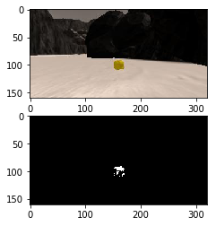
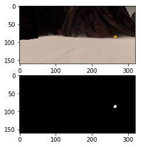
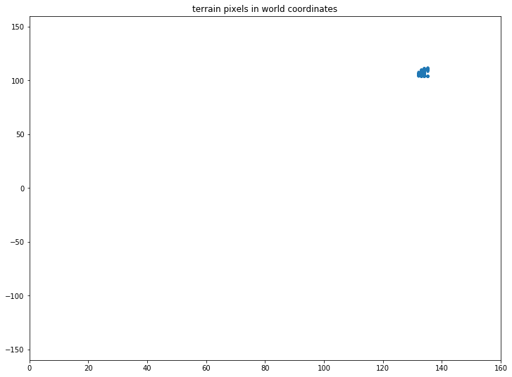

## Project: Search and Sample Return

---

---

#### 1) Notebook Analysis

#### Image processing - color thresholding

As explained [here](https://docs.opencv.org/3.2.0/df/d9d/tutorial_py_colorspaces.html), I added some functions to use HSV color thresholding to segmentate the rock samples. The code from the notebook is shown below.

```python
## HSV color thresholding
def hsv_thresh( img, lo, hi ) :
    _img_hsv = cv2.cvtColor( img, cv2.COLOR_BGR2HSV )
    _res = cv2.inRange( _img_hsv, lo, hi )
    return _res
```

First, we convert the image to HSV space, and then just pick the range given by **lo** and **hi** .

After some tuning, the **lo** and **hi** ranges to segment the samples were set to :

```python
# ranges for rock-sample segmentation
g_hsv_threshold_rock_lo = np.array( [ 50, 98, 150 ] )
g_hsv_threshold_rock_hi = np.array( [ 140, 255, 255 ] )
```

Below you can see the results of segmenting the rock samples using the previous method :





    
For the navigable terrain and the obstacles I used rgb-thresholding as shown in the following snippet :

```python
## RGB color thresholding
def rgb_thresh( img, lo, hi ) :
    _res = cv2.inRange( img, lo, hi )
    return _res
```

For the **lo** and **hi** ranges we picked the values from the lecture, and as suggested, just inverted the nav-terrain ranges to get the obstacle ranges. The values and the results are shown below.

```python
# ranges for obstacle segmentation
g_rgb_threshold_obstacles_lo = np.array( [ 0, 0, 0 ] )
g_rgb_threshold_obstacles_hi = np.array( [ 160, 160, 160 ] )

# ranges for terrain segmentation
g_rgb_threshold_terrain_lo = np.array( [ 160, 160, 160 ] )
g_rgb_threshold_terrain_hi = np.array( [ 255, 255, 255 ] )
```


#### Image processing - full pipeline and worldmap creation

I filled the **process_image** method with all the methods involved in the image processing pipeline as requested. The implementation is in the notebook, and these are the parts involved.

*  **Perspective transformation**

    As seen in the classroom, the points chosen to create the perspective transformation matrix are created as follows :

    ```python
    # 1) Define source and destination points for perspective transform
    _dst_size = 5 
    _btm_offset = 6
    _w = img.shape[1]
    _h = img.shape[0]
    _src_pts = np.float32( [ [16, 141], [303 ,141],[201, 98], [120, 98] ] )
    _dst_pts = np.float32( [ [ _w / 2 - _dst_size, _h - _btm_offset ],
                             [ _w / 2 + _dst_size, _h - _btm_offset ],
                             [ _w / 2 + _dst_size, _h - 2 * _dst_size - _btm_offset ], 
                             [ _w / 2 - _dst_size, _h - 2 * _dst_size - _btm_offset ],
                           ])
    ```

    These are the mapping of the trapezoid in the calibration image ( which represents a 1mx1m square ) to a square of size 10px in rover coordinates ( as represented by _dst_size, which is half the size of the square ). There is also an offset that represents the distance between the square mapped and the actual position of the camera respect to the rover.

    Once we have these mapping points we can call our perspective transform method :

    ```python
    # 2) Apply perspective transform
    _img_warped = perspect_transform( img, _src_pts, _dst_pts )
    ```

    The result of this step is an image like this :


*   **Image thresholding**

    The next step is to segmentate into navigable terrain, obstacles and rock samples. We just call our thresholding functions mentioned before.

    ```python
    # 3) Apply color threshold to identify navigable terrain/obstacles/rock samples
    
    # ranges for terrain segmentation
    _rgb_threshold_terrain_lo = np.array( [ 160, 160, 160 ] )
    _rgb_threshold_terrain_hi = np.array( [ 255, 255, 255 ] )
    # ranges for obstacle segmentation
    _rgb_threshold_obstacles_lo = np.array( [ 0, 0, 0 ] )
    _rgb_threshold_obstacles_hi = np.array( [ 160, 160, 160 ] )
    # ranges for rock segmentation
    _hsv_threshold_rocks_lo = np.array( [ 20, 98, 40 ] )
    _hsv_threshold_rocks_hi = np.array( [ 100, 255, 255 ] )
    
    _img_threshed_terrain   = rgb_thresh( _img_warped, _rgb_threshold_terrain_lo, _rgb_threshold_terrain_hi )
    _img_threshed_obstacles = rgb_thresh( _img_warped, _rgb_threshold_obstacles_lo, _rgb_threshold_obstacles_hi )
    _img_threshed_rocks     = hsv_thresh( _img_warped, _hsv_threshold_rocks_lo, _hsv_threshold_rocks_hi )
    ```

    This would give us three images to work with in the next stage. An example is shown below.


*   **Transformation to Rover-centric coordinates**

    In this stage we take the threshed images and trasnform them into rover centric coordinates.

    As explained in the classroom, the image we get is respect to to the camera's frame of reference, but the rover frame of reference ( respect to which we get the orientation and position data from the other sensors ) is a bit different, as can be seen in the following figure.


    To implement this step we call the function defined previously that is in charge of this transformation.

    ```python
    def rover_coords( binary_img ) :
        ypos, xpos = binary_img.nonzero()
        x_pixel = np.absolute(ypos - binary_img.shape[0]).astype(np.float)
        y_pixel = -(xpos - binary_img.shape[0]).astype(np.float)

        return x_pixel, y_pixel
    ```

    This method will take all non-zero pixels in a binary image and transform them from the camera frame to the rover frame of reference.
    In the following images you can see the results of applying this function to a terrain threshed image and a rock-sample threshed image, giving the pixels that are non zero in the rover coordinate system.


    This pixels are used in the decision step to give the rover a direction to go ( terrain navigable pixels ) and the direction to a rock, if there is one ( rock pixels ) as you could see by the two arrows in the images above.

*   **Transformation from Rover to World coordinates**

    By using the position and orientation provided by the other sensors we can transform the previous terrain pixels into world space by using the following functions.

    ```python
    def rotate_pix(xpix, ypix, yaw) :
        yaw = yaw * np.pi / 180.
        xpix_rotated = np.cos( yaw ) * xpix - np.sin( yaw ) * ypix
        ypix_rotated = np.sin( yaw ) * xpix + np.cos( yaw ) * ypix
        return xpix_rotated, ypix_rotated

    def translate_pix(xpix_rot, ypix_rot, xpos, ypos, scale): 
        xpix_translated = ( xpix_rot / scale ) + xpos
        ypix_translated = ( ypix_rot / scale ) + ypos
        return xpix_translated, ypix_translated

    def pix_to_world(xpix, ypix, xpos, ypos, yaw, world_size, scale):
        xpix_rot, ypix_rot = rotate_pix(xpix, ypix, yaw)
        xpix_tran, ypix_tran = translate_pix(xpix_rot, ypix_rot, xpos, ypos, scale)
        x_pix_world = np.clip(np.int_(xpix_tran), 0, world_size - 1)
        y_pix_world = np.clip(np.int_(ypix_tran), 0, world_size - 1)
        return x_pix_world, y_pix_world
    ```

    This step is implemented in the following piece of code in the process_image function :

    ```python
    _rover2world_scale = 10
    _world_size = 200

    _x = data.xpos[ data.count ]
    _y = data.ypos[ data.count ]
    _yaw = data.yaw[ data.count ]
    
    x_navigable_world, y_navigable_world = pix_to_world( x_navigable_rover, 
                                                         y_navigable_rover,
                                                         _x, _y, _yaw, 
                                                         _world_size, 
                                                         _rover2world_scale )
    
    x_obstacles_world, y_obstacles_world = pix_to_world( x_obstacles_rover, 
                                                         y_obstacles_rover,
                                                         _x, _y, _yaw, 
                                                         _world_size, 
                                                         _rover2world_scale )
    
    x_rocks_world, y_rocks_world         = pix_to_world( x_rocks_rover, 
                                                         y_rocks_rover,
                                                         _x, _y, _yaw, 
                                                         _world_size, _rover2world_scale )
    ```

    Again, there is a scale factor in here, as each pixel represents a square of 1mx1m. Taking this into account and the fact that the pixels from the previous stage represent 0.1mx0.1m, we set the scale factor to 10. Also, the size of the world is given, which is also used in the transformation.

    This would give us a result like the following :



*   **Worldmap creation**

    Finally, the last step is to use the pixels that represent the terrain, obstacles and rock-samples to create our worldmap. This is done in this piece of code :

    ```python
    data.worldmap[y_obstacles_world, x_obstacles_world, 0] += 1
    data.worldmap[y_rocks_world, x_rocks_world, 1] += 1
    data.worldmap[y_navigable_world, x_navigable_world, 2] += 1
    ```

    Here we are basically creating an image of the nav-terrain, obstacles and rock-samples using the pixels from the previous stage. Each layer of the rgb image represents the obstacles, rocks and nav-terrain respectively.

#### 1. Populate the `process_image()` function with the appropriate analysis steps to map pixels identifying navigable terrain, obstacles and rock samples into a worldmap.  Run `process_image()` on your test data using the `moviepy` functions provided to create video output of your result. 
And another! 

![alt text][image2]
### Autonomous Navigation and Mapping

#### 1. Fill in the `perception_step()` (at the bottom of the `perception.py` script) and `decision_step()` (in `decision.py`) functions in the autonomous mapping scripts and an explanation is provided in the writeup of how and why these functions were modified as they were.


#### 2. Launching in autonomous mode your rover can navigate and map autonomously.  Explain your results and how you might improve them in your writeup.  

**Note: running the simulator with different choices of resolution and graphics quality may produce different results, particularly on different machines!  Make a note of your simulator settings (resolution and graphics quality set on launch) and frames per second (FPS output to terminal by `drive_rover.py`) in your writeup when you submit the project so your reviewer can reproduce your results.**

Here I'll talk about the approach I took, what techniques I used, what worked and why, where the pipeline might fail and how I might improve it if I were going to pursue this project further.  


![alt text][image3]


